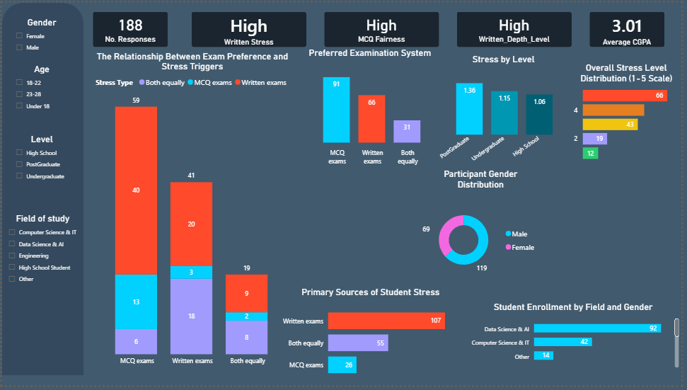

# Phase Six: Data Analysis Plan

## Overview

This phase focuses on analyzing survey data related to student preferences and experiences with different examination systems (MCQ vs Written). The analysis will be conducted using two main tools:

- **Power BI** → for descriptive analysis and visualization
- **Python (Jupyter Notebook)** → for statistical testing and predictive modeling

---

# 1. Data Preparation

Before analysis, the dataset will be cleaned and transformed:

## Data Transformation

- Group open-ended responses:
  - Field of Study → (Engineering, Business, Medical, etc.)
  - Perfect Exam System → (MCQ, Written, Projects, Mixed)

## Encoding

- Create numerical versions of categorical columns:
  - Gender → Male=1, Female=0
  - Level → High School=0, Undergraduate=1, Postgraduate=2
  - Age → Under 18=0, 18–22=1, 23–28=2
  - Exam Frequency → Rarely=0, Sometimes=1, Very Often=2
  - Exam Type (Stress/Preference) → MCQ=0, Written=1, Both=2

- Likert Scale Questions remain numeric:
  - 1 = Strongly Disagree
  - 5 = Strongly Agree

---

# 2. Power BI Analysis

Power BI will be used for **Descriptive Statistics, Correlation Exploration, and Visualization**.

## A. Descriptive Statistics

- Calculate:
  - Mean (e.g., average stress level)
  - Counts (e.g., number of students by gender)
  - Frequency distributions (MCQ vs Written preference)

## B. Data Visualization

The analysis results in a comprehensive dashboard that tracks student sentiment and academic trends.

- Preparation difficulty vs performance perception

---

# 3. Python Analysis (Jupyter Notebook)

Python will be used for **Inferential Statistics and Regression Analysis**.

## A. Correlation Analysis

- Compute correlation matrix
- Identify strength and direction of relationships between variables

Example:

- Stress vs Time Pressure
- MCQ fairness vs knowledge reflection

---

## B. Inferential Statistics

### 1. Independent Samples T-Test
* **Goal:** Compare stress levels between students who prefer MCQ vs. Written exams.
* **Results:** * **T-statistic:** `1.094`
    * **P-value:** `0.278`
* **Conclusion:** Since the P-value > 0.05, the difference is **not statistically significant**. A student's preferred exam type does not predict their general stress level.

---

### 2. Chi-Square Test
* **Goal:** Test the relationship between **Gender** and **Preferred System Type**.
* **Results:**
    * **Chi-Square Statistic:** `7.046`
    * **P-value:** `0.133`
* **Conclusion:** No significant dependency found. Exam preference is independent of gender in this dataset.

---

## C. Regression Analysis

We built a predictive model to understand the factors driving **Written Exam Time Stress**.

### OLS Regression Results
> **Note:** Highlighted values indicate key performance and significance metrics.

| Metric | Value |
| :--- | :--- |
| **Dep. Variable** | Likert_Written_Time_Stress |
| **R-squared** | <mark><b>0.298</b></mark> |
| **Adj. R-squared** | 0.283 |
| **Prob (F-statistic)** | <mark><b>2.46e-13</b></mark> |

#### Detailed Coefficients:
| Variable | coef | P>\|t\| | Interpretation |
| :--- | :--- | :--- | :--- |
| **const** | 1.3458 | 0.001 | Baseline stress level |
| **Likert_Stress_Comparison** | <mark>0.4695</mark> | <mark><b>0.000</b></mark> | **Strongest Predictor** (Positive Impact) |
| **Likert_MCQ_Guessing** | <mark>0.2254</mark> | <mark><b>0.001</b></mark> | **Significant** (Guessing increases stress) |
| **Better System** | -0.2224 | 0.066 | Marginally Significant |
| **Likert_Written_Measure**| -0.0711 | 0.294 | Not Significant |

### Final Insight:
The model explains **30%** of the variance in time-related stress. The most critical discovery is that students who rely on **Guessing** in MCQs face significantly higher stress in written formats, and the **Mental Comparison** between systems is the primary psychological driver of anxiety.

---

### Analysis Visualization

# 4. Interpretation & Reporting

## The final results will be documented in a Word report.

# 5. Final Workflow

1. Clean and preprocess data (Python)
2. Create structured dataset
3. Import into Power BI → build dashboard
4. Export dataset → analyze in Python
5. Perform statistical tests and regression
6. Write final report with insights and conclusions

---

# Outcome

By the end of this phase, the project will include:

- Interactive Power BI Dashboard
- Python Notebook with statistical analysis
- Written report with clear interpretations and conclusions
